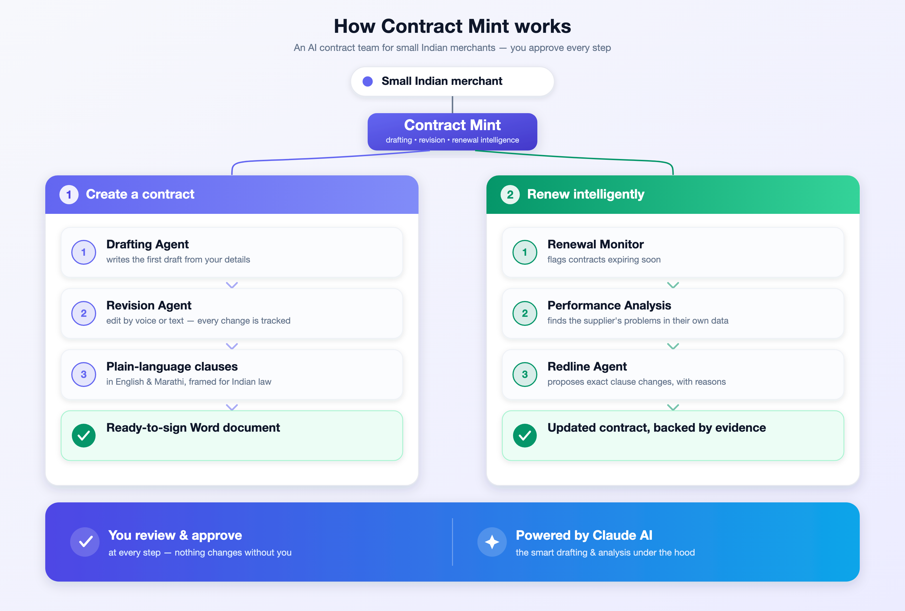
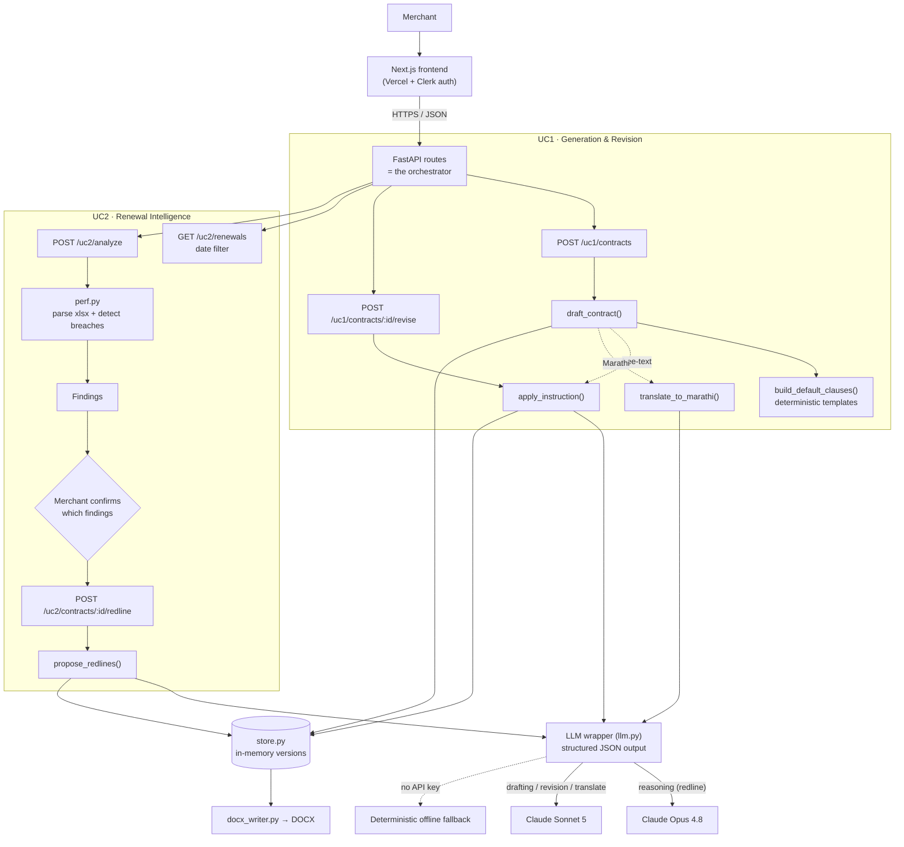
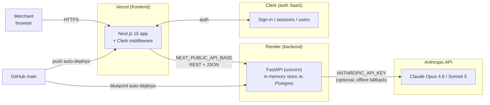

# Contract Mint — Architecture

> **Status legend:** ✅ built today · 🔜 planned / target design. This is a blueprint —
> several items below are intentionally aspirational. See
> [`agent-contracts.md`](agent-contracts.md) for the as-built agent/data contracts.

## Simplified view (for non-technical readers)

The whole product in one picture — the agents grouped by the two use cases, with a human
approving every step. Source: [`architecture-simple.svg`](images/architecture-simple.svg)
(editable) → exported to [`architecture-simple.png`](images/architecture-simple.png).



The rest of this section is the **technical** view of the same system.

## Agent architecture (as built)

Pattern: **single agent + tools, orchestrated by code** — not a multi-agent swarm.
FastAPI routes are the orchestrator; three functions call Claude; everything else is
deterministic. Every LLM call has a deterministic offline fallback (runs with no API key).



Legend: solid = always runs; dotted = conditional. Tracked changes (`ClauseChange` with
`old/new/rationale/source`) mean edits are never silent overwrites.

## Deployment topology (live)



One `git push` to `main` fans out: Vercel rebuilds the frontend, Render rebuilds the
backend. Clerk and the Anthropic API are external SaaS the app talks to at runtime.

## Stack
- ✅ **Frontend:** Next.js (React, TypeScript). Runs on Replit for the demo.
  🔜 Lift to Vercel for production. Fresh design (HTML prototype is only a UC2 flow reference).
- ✅ **Backend:** Python + FastAPI. FastAPI **routes** orchestrate the flow and make the
  Claude API calls directly — there is no separate orchestrator process (🔜 that's a future
  target, see agent-contracts.md).
- ✅ **DB (demo):** in-memory store ([`store.py`](../backend/app/store.py), keyed by
  `tenant_id`; single default tenant). 🔜 **Postgres**, multi-tenant via `tenant_id` on
  every table — `store.py` is designed to swap onto SQLAlchemy models behind the same interface.
- 🔜 **Storage:** object storage (S3-compatible) for DOCX + version history (demo generates
  DOCX on the fly; no persistent object store yet).
- 🔜 **Scheduler:** cron/queue for the Renewal Monitor (today it's an on-demand date filter
  on `GET /uc2/renewals`).
- ✅ **Models:** `claude-opus-4-8` for reasoning-heavy work (analysis, redline);
  configured Sonnet for high-volume steps (drafting, applying edits) — see
  [`config.py`](../backend/app/config.py). ⚠️ Verify the drafting model ID against the
  current API ref before shipping; `claude-sonnet-4-6` is not a released ID (current Sonnet
  is `claude-sonnet-5`).

## Repo layout (proposed)
```
contract-mint/
  docs/                     # clause-library, agent-contracts, architecture (this)
  frontend/                 # Next.js app
    app/
      uc1-generate/         # context form -> draft -> editor -> versioned DOCX
      uc2-renewals/         # alert dashboard -> upload perf -> validate -> redline
    components/
    lib/
  backend/
    app/
      agents/               # ✅ drafting, revision, redline (the 3 LLM-touching units)
      models.py             # ✅ pydantic models (Contract, ClauseChange, Finding, ...)
      ingestion/            # ✅ Excel/perf reader + breach detection (perf.py)
      clauses/              # ✅ India clause library (library.py; from docs/clause-library.md)
      docgen/               # ✅ DOCX generation (docx_writer.py)
      store.py              # ✅ in-memory store (🔜 swap for Postgres/SQLAlchemy)
      llm.py, config.py     # ✅ Claude client + settings
      api/                  # ✅ FastAPI routes (uc1.py, uc2.py) — these orchestrate
    tests/
```
> 🔜 Not yet built: `orchestrator`, `renewal_monitor`, `performance_analysis` as separate
> agents (folded into API routes + `ingestion/perf.py`), a `db/` layer, and the typed
> inter-agent envelopes.

## Data model (🔜 target Postgres schema — today these live as in-memory objects)
Core tables, all carry `tenant_id`:
- `tenants`
- `suppliers` (name, email, PAN/GSTIN, renewal_date)
- `performance_metrics` (supplier_id, metric, value, period) — schema flexes to the
  merchant's actual CSV/Excel columns; rollup score derived, not stored as input
- `contracts` (supplier_id, status, current_version)
- `contract_versions` (contract_id, version, clauses JSON, docx_uri, created_by)
- `clause_changes` (version_id, clause_id, old, new, rationale, source)
- `gate_feedback` (trace_id, clause_id, decision, edited_text) — self-learning store

## Human-in-the-loop gates (first-class)
1. UC1: merchant confirm before finalizing/printing a version.
2. UC2: merchant validates `findings` before redlining.
3. UC2: merchant accepts/rejects/edits each `redline_result` proposal.
🔜 Persisting each gate decision to `gate_feedback` (self-learning store) is planned, not yet wired.

## Build phases
- **Phase 0:** scaffold + schema + agent contracts + ingestion (no pending uploads needed).
- **Phase 1:** UC1 end-to-end (generate → editor → versioned DOCX).
- **Phase 2:** UC2 (monitor → analysis → validate → redline) — needs the perf spreadsheet.
- **Phase 3:** demo polish.
```
